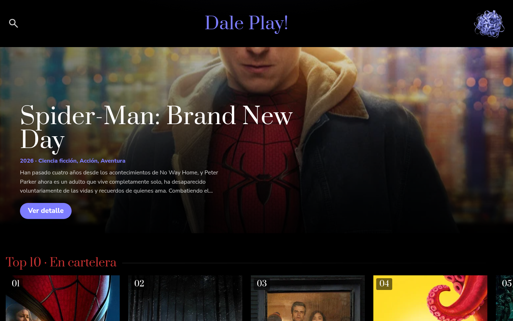
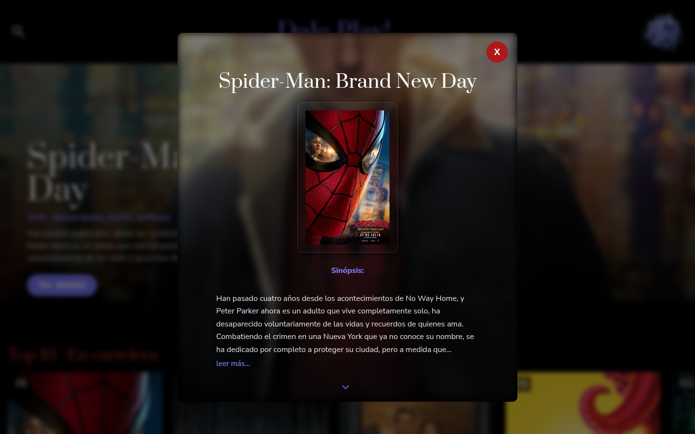
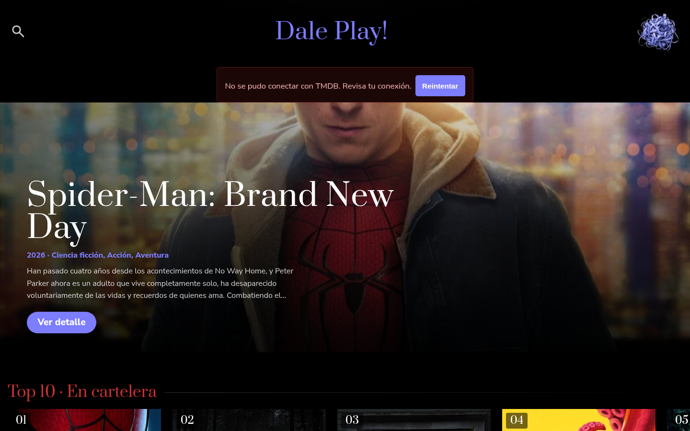
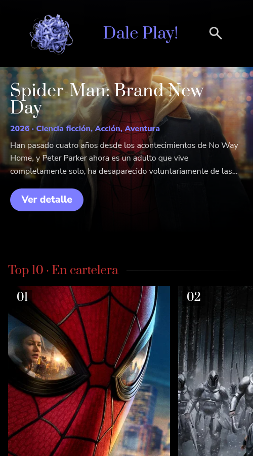
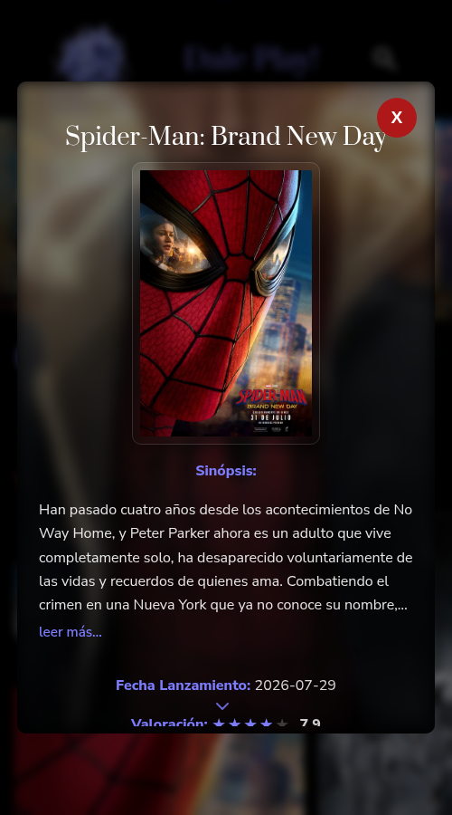
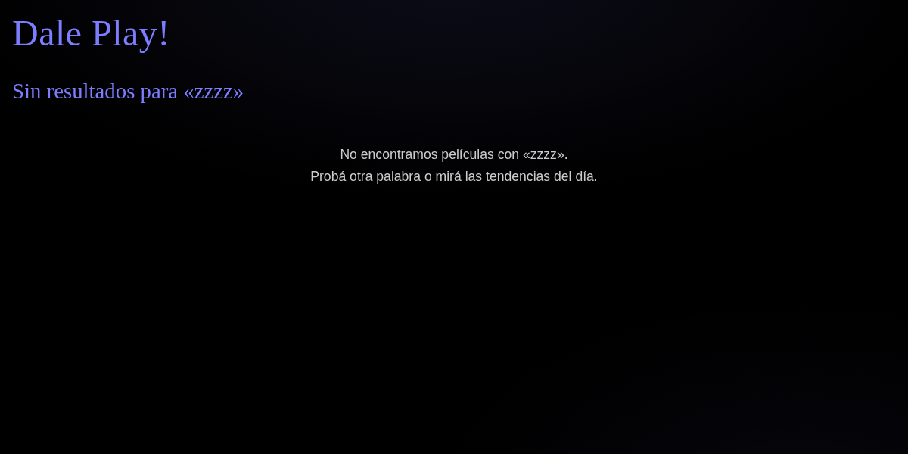

# Dale Play!

Descubrimiento de cine en español: cartelera, próximos estrenos, populares y mejor calificadas sobre la API de TMDB. Vanilla HTML/CSS/JS, sin framework ni build.

## Características

- Home con hero de portada ("En cartelera hoy") y 4 secciones Top 10 en carruseles (scroll-snap, swipe táctil, flechas desde 768px y navegación por teclado).
- Búsqueda por 3 criterios: Título, Actor / Actriz y Tendencias del día.
- Modal de detalle: sinopsis, fecha y géneros para películas; biografía, lugar/fecha de nacimiento y créditos para personas; valoración en estrellas.
- Estados completos: carga, vacío (sin resultados) y error con "Reintentar" (región `aria-live`).
- Diseño "La Sala Oscura": accesibilidad (focus visible, etiquetas sr-only, `prefers-reduced-motion`), responsive con objetivos táctiles ≥44px y safe areas para notches. Ver [DESIGN.md](DESIGN.md).

## Screenshots

### Escritorio

| Home | Modal de detalle | Estado de error |
| --- | --- | --- |
|  |  |  |

### Móvil

| Home | Modal de detalle | Sin resultados |
| --- | --- | --- |
|  |  |  |

## Cómo ejecutar localmente

1. Clonar el repositorio y abrirlo en VS Code.
2. Copiar `config.example.js` como `config.js` y reemplazar `TU_API_KEY` con tu clave de la API de TMDB (https://www.themoviedb.org/documentation/api).
3. Servir el proyecto con Live Server (puerto 5501). `config.js` está en `.gitignore`, así que tu clave nunca se sube.

## Estructura

```
├── assets/imgs/        Logo y placeholders
├── css/style.css       Diseño: tokens, componentes y responsive
├── js/script.js        Lógica en módulos ES
├── index.html          Página principal
└── config.example.js   Configuración versionada (API key, URLs de TMDB)
```

## Stack

HTML5 · CSS3 (tokens, `<dialog>`, scroll-snap, `prefers-reduced-motion`) · JavaScript (ES modules) · API TMDB v3 (`es-ES`).

## Atribución y licencia

Los datos y artes pertenecen a [TMDB](https://www.themoviedb.org) (API pública). Proyecto educativo sin fines de lucro, no afiliado ni certificado por TMDB. © 2026 Franco Calderón.